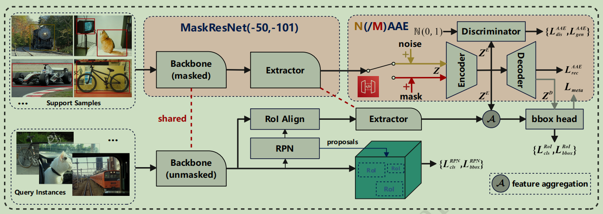

# AML: Adversarial Meta-Learning for Few-Shot Object Detection


This package includes our codes for implementing "Adversarial Meta-Learning for Few-Shot Object Detection". 
(First Release Date: 2025-04-12)

## 1.Introduction

*Conventional high-efficiency object detection relies on numerous annotated samples, while few-shot object detection (FSOD) suffers from a shortage of trainable samples, increasing the task complexity.
Meta-learning persists as the primary solution, which commences with the construction of one meta-detector and elevates its meta-learning ability and generalization through episodic meta-training.
Current meta-methods focuses on better feature extraction from annotated samples and constructing superior meta-detectors. 
In this paper, we introduce a novel FSOD framework, termed Adversarial Meta-Learning (AML). To begin with, we propose a masked meta-backbone with Non-RoI masking, MaskResNet. This design is specifically crafted to concentrate on extracting the primary features within the regions of interest (RoI).
To address the overfitting challenge arising from MaskResNet’s emphasis on the local feature distribution, we further put forward two adversarial autoencoders.
Specifically, we leverage the gaussian noise and the random mask to augment feature diversity, generate latent features with an encoder, and reconstruct features with a decoder. Another discriminator differentiates latent data (fake) from random gaussian features (real). Adversarial learning between the real and fake features boosts the autoencoder's generation and the discriminator's discrimination abilities. 
Experiments on the PASCAL VOC and COCO benchmarks clearly prove that AML not only outshines similar meta-learning FSOD methods but also sets a remarkable state-of-the-art standard.*
<p align="center"></p>


## 2.Installation & Benchmarks
* **Installation**

```bash
conda create -n FSDet python=3.8
conda activate FSDet
conda install pytorch==1.12.1 torchvision==0.13.1 torchaudio cudatoolkit=11.3 -c pytorch

pip install openmim
mim install mmcv-full==1.6.0
pip install mmcls==0.25.0
pip install mmdet==2.24.0
pip install yapf==0.40.1

# manually download and install mmfewshot: https://github.com/open-mmlab/mmfewshot.git
cd mmfewshot
pip install .

# install our AML
python setup.py develop

pip install pandas==1.4
pip install matplotlib==3.2
pip install ftfy
pip install regex 
pip install scikit-learn
pip install numpy==1.19.0
```

* **Prepare Datasets**: 

```bash
Please refer to mmfewshot's [detection data preparation](https://github.com/open-mmlab/mmfewshot/blob/main/tools/data/README.md).
```

Note that: 
You can download our prepared [util_mm](https://github.com/ChaofeiQI/AML/releases/tag/release/util_mm.zip) and [data] (https://github.com/ChaofeiQI/AML/releases/tag/release/data.zip)

## 3.Meta-Base-training, Meta-Fine-tuning and Meta-testing

* **Meta-Base Training**

```bash
voc_config_dir=configs/aml_config/{dataset}
for split in 1 2 3; do
        config_path=${voc_config_dir}/split${split}/maskresnet_aml_voc-split${split}_base-training.py
        echo $config_path
        bash dist_train1_voc.sh $config_path 4
done
```

* **Meta-Fine Tuning**
```bash
voc_config_dir=configs/aml_config/{dataset}
for split in 1 2 3; do
    for shot in 1 2 3 5 10; do
        config_path=${voc_config_dir}/split${split}/maskresnet_aml_voc-split${split}_${shot}shot-fine-tuning.py
        echo $config_path
        bash dist_train1_voc.sh $config_path 1
    done
done
```

* **Meta Testing**
```bash
voc_config_dir=configs/aml_config/{dataset}
for split in 1 2 3; do
    for shot in 1 2 3 5 10; do
        config_path=${voc_config_dir}/split${split}/maskresnet_aml_voc-split${split}_${shot}shot-fine-tuning.py
        checkpoint=./work_dirs/maskresnet_aml_voc-split${split}_${shot}shot-fine-tuning/latest.pth
        echo $config_path
        echo $model_path
        bash dist_test.sh $config_path $checkpoint 1 --eval mAP|bbox
    done
done
```
**Note**: All our configs and models are base-trained with 4 gpus. You need to change the learning rate or batch size if you use fewer/more gpus.


## 4.Few-Shot Object Detection Results: 
```bash**
```


## License
- Our code refers the corresponding code publicly available: [mmfewshot](https://github.com/open-mmlab/mmfewshot), [TFA](https://github.com/ucbdrive/few-shot-object-detection), [FPD](https://github.com/wangchen1801/FPD).
- This repository is released under the MIT License. License can be found in [LICENSE](LICENSE) file.
